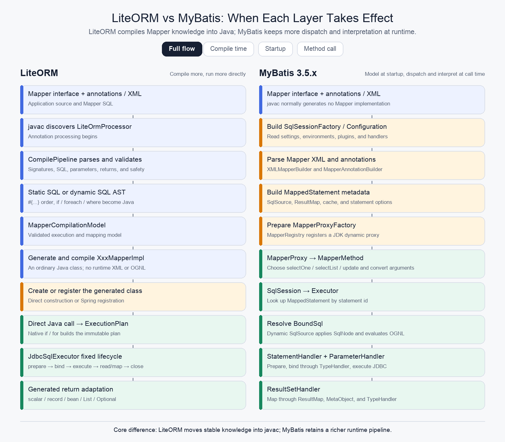

# lite-orm

`lite-orm` is a compile-time-first Java Mapper platform. It generates ordinary Java implementations from Mapper interfaces, annotations, and optional XML, then executes immutable plans through a small JDBC runtime.

It is not a feature-for-feature MyBatis clone. The main goal is to move SQL normalization, supported dynamic expressions, parameter order, binder selection, and result mapping into compilation so the runtime path remains explicit and debuggable.

The supported first-GA boundary is defined in [Core GA contract](docs/core-ga-contract.md).

## Modules

- `lite-orm-core`: annotations, annotation processor, SQL/XML compiler, generated Mapper source, execution contracts, standalone JDBC assembly, and local transactions.
- `lite-orm-spring-boot-starter`: explicit Mapper-package registration, Spring-aware connection participation, and generated Mapper bean definitions.
- `lite-orm-examples/basic-mapper`: executable annotation/XML, provider, binder, row-mapper, batch, generated-key, and standalone PostgreSQL/MySQL Testcontainers fixtures.
- `lite-orm-benchmarks`: JMH comparison of Direct JDBC, generated LiteORM Mappers, and MyBatis; compiled during normal builds but executed only by explicit benchmark commands.

Run the full repository verification with:

```bash
mvn clean test
```

## Performance Baseline

The Core GA JMH baseline compares generated LiteORM Mappers, MyBatis, and Direct JDBC with the same H2 DataSource, schema, SQL parameters, connection/session lifecycle, and consumed results. Lower `µs/op` is better. "LiteORM faster" is calculated as `(MyBatis - LiteORM) / MyBatis`.

| Scenario | LiteORM µs/op | MyBatis µs/op | Direct JDBC µs/op | LiteORM faster than MyBatis |
| --- | ---: | ---: | ---: | ---: |
| Scalar query | 3.477 | 4.239 | 2.475 | 18.0% |
| Record mapping | 3.916 | 5.803 | 2.940 | 32.5% |
| JavaBean mapping | 3.946 | 5.924 | 2.803 | 33.4% |
| Dynamic SQL, one row | 27.013 | 28.455 | 25.184 | 5.1% |
| Cursor, ten rows | 3.362 | 8.969 | 3.226 | 62.5% |
| Local transaction + scalar | 4.146 | 4.284 | 2.680 | 3.2% |
| JDBC batch, 100 rows | 41.319 | 71.573 | 40.021 | 42.3% |
| Generated key | 3.229 | 4.772 | 2.766 | 32.3% |

In this controlled fixture LiteORM is 3.2%–62.5% faster than MyBatis across the measured scenarios, while Direct JDBC remains the lower-bound reference. These are framework-overhead measurements on H2, not PostgreSQL/MySQL production-latency claims. See the [full protocol, allocation results, and JFR observations](docs/benchmarks/core-ga-baseline.md).

## LiteORM vs MyBatis Lifecycle

The animation highlights what takes effect during compilation, application startup, and each Mapper method call.



LiteORM generates an ordinary `*MapperImpl` during javac annotation processing. MyBatis normally builds Mapper metadata and proxy factories at startup, then routes calls through its runtime proxy, session, executor, SQL-source, and handler pipeline.

## Compile-Time Model

Supported first-stage inputs include:

- LiteORM annotations under `org.liteorm.annotation`.
- `@Select`, `@Insert`, `@Update`, `@Delete`, `@Batch`, and explicit generated-key columns such as `@GeneratedKey("id")`.
- XML Mapper statements.
- XML-over-annotation precedence with a method-scoped compiler warning.
- `if`, `choose`, `when`, `otherwise`, `trim`, `where`, `set`, `foreach`, `bind`, `sql`, and `include`.
- A controlled OGNL-like expression subset translated into native Java.
- Scalars, records, JavaBeans, lists, generated keys, and JDBC batch counts.
- Typed `SqlProvider`, `ParameterBinder`, and `RowMapper` escape hatches.

Generated `*MapperImpl` classes:

- implement the Mapper interface directly;
- receive exactly one `SqlExecutor` through their constructor;
- build ordered `ExecutionPlan` or `BatchExecutionPlan` instances;
- contain native Java dynamic SQL, binding, and result mapping;
- contain no Spring annotations, runtime Mapper proxy, reflection-based dispatch, runtime XML parser, or runtime expression engine.

`LiteOrmProcessor` is the only public type in `org.liteorm.compile`. Parser, AST, compilation-model, and code-generator types are internal implementation details rather than application extension APIs.

The core compatibility suite runs the same generated Mapper, local transaction, batch, cursor, timeout, temporal, identifier, binary, and generated-key contracts against pinned PostgreSQL 16.4 and MySQL 8.4.0 containers. Generated keys name their column explicitly so JDBC requests only that column on drivers such as PostgreSQL that otherwise return the inserted row.

## Standalone JDBC

One `JdbcAssembly` represents one DataSource and transaction domain:

```java
DataSource dataSource = createDataSource();

JdbcAssembly assembly = LiteOrm.jdbc(dataSource)
    .domain("users")
    .build();

UserMapper userMapper = new UserMapperImpl(assembly.sqlExecutor());
```

Calls outside an explicit transaction use temporary auto-commit connection handles. Use the assembly's callback executor when several Mapper calls must share one connection and commit or roll back together:

```java
User user = assembly.transactionalExecutor().execute(() -> {
    userMapper.insert(1L, "Alice", "alice@example.com", 30);
    return userMapper.findById(1L);
});
```

`SqlExecutor` owns the fixed JDBC lifecycle. `ConnectionHandleFactory` creates one connection-only `ConnectionHandle` per execution. `SimpleConnectionHandleFactory` joins the thread-bound root transaction created by `TransactionalExecutor`; transaction completion remains internal, nested callbacks join the root, and a nested failure marks that local transaction rollback-only. Propagation policies, savepoints, declarative isolation/read-only rules, and production transaction orchestration belong to Spring or another host transaction manager.

## Spring Boot

Spring registration is explicit even for one DataSource:

```yaml
lite-orm:
  enabled: true
  mapper-bindings:
    - package-name: com.example.user.mapper
      data-source: dataSource
```

At startup the starter:

1. scans each configured package for generated `*MapperImpl` classes;
2. resolves the named Spring `DataSource` bean;
3. creates one Spring-aware `SqlExecutor` for that DataSource;
4. registers each implementation under the JavaBeans-decapped interface name, for example `UserMapper` as `userMapper`.

Generated classes remain Spring-neutral. Registration occurs through `BeanDefinitionRegistryPostProcessor`; Mapper invocation is direct Java dispatch and performs no runtime package or bean lookup.

Inside `@Transactional`, `SpringConnectionHandleFactory` obtains and releases the thread-bound connection through `DataSourceUtils`. The handle has no commit or rollback authority because Spring owns boundary timing. Outside a Spring transaction, execution follows the DataSource's normal auto-commit behavior.

The `PlatformTransactionManager` used by `@Transactional` must manage the same DataSource as the Mapper package binding. A mismatch fails explicitly rather than silently executing outside the intended transaction.

## Multiple DataSources

Mapper and DataSource ownership is strictly one-to-one:

- one Mapper interface is registered once;
- one Mapper package binding names one physical or routing DataSource bean;
- applications with several DataSources use disjoint Mapper packages and independent executor graphs;
- duplicate, parent, and child package bindings cannot overlap;
- the same Mapper interface is never bound to several DataSources.

Standalone applications create one `JdbcAssembly` per DataSource:

```java
JdbcAssembly users = LiteOrm.jdbc(usersDataSource).domain("users").build();
JdbcAssembly archive = LiteOrm.jdbc(archiveDataSource).domain("archive").build();
```

Core does not coordinate distributed commits. If one business operation spans several assemblies, each transaction remains independent unless the application supplies an external distributed-transaction solution.

A routing DataSource may be bound as the package's single DataSource. In that case routing, tenant context, shard selection, and physical connection ownership belong to the routing DataSource and its transaction manager—not to `ExecutionPlan`. Use an optional `SqlExecutor` decorator only when routing cannot be represented by the DataSource itself and the application accepts that explicit ownership.

## Extension Order

Prefer the narrowest typed extension:

1. generated annotation/XML SQL;
2. `SqlProvider<P>` for exceptional runtime SQL structure;
3. `ParameterBinder<T>` for one JDBC value type;
4. `RowMapper<T>` for one unsupported row shape;
5. `ExecutionInterceptor` for observation such as logs, metrics, audit, or authorization;
6. an explicit `SqlExecutor` decorator only for exceptional whole-execution routing;
7. raw JDBC when the generated or typed contracts do not fit.

Provider, binder, row-mapper, and interceptor instances are reused. Implementations must be stateless, thread-safe, or externally synchronized.

## Compatibility Boundary

LiteORM intentionally does not promise arbitrary OGNL, complex `resultMap` graphs, nested aggregation, lazy loading, MyBatis plugins, runtime XML reload, second-level cache, or same-Mapper multi-DataSource binding. Unsupported behavior should fail during compilation with diagnostics attached to the Mapper method whenever javac can represent the location.

See:

- [Chinese README](README_cn.md)
- [Design philosophy](Design-Philosophy.md)
- [Documentation index](docs/README.md)
- [Core GA contract](docs/core-ga-contract.md)
- [Extension contracts](docs/extensions.md)
- [Migration guide](docs/migration-guide.md)
- [MyBatis compatibility matrix](docs/mybatis-compatibility.md)
- [Active adoption roadmap](docs/superpowers/specs/2026-08-17-liteorm-adoption-roadmap-design.md)
- [Executable basic Mapper example](lite-orm-examples/basic-mapper/README.md)
- [Core GA benchmark baseline](docs/benchmarks/core-ga-baseline.md)
