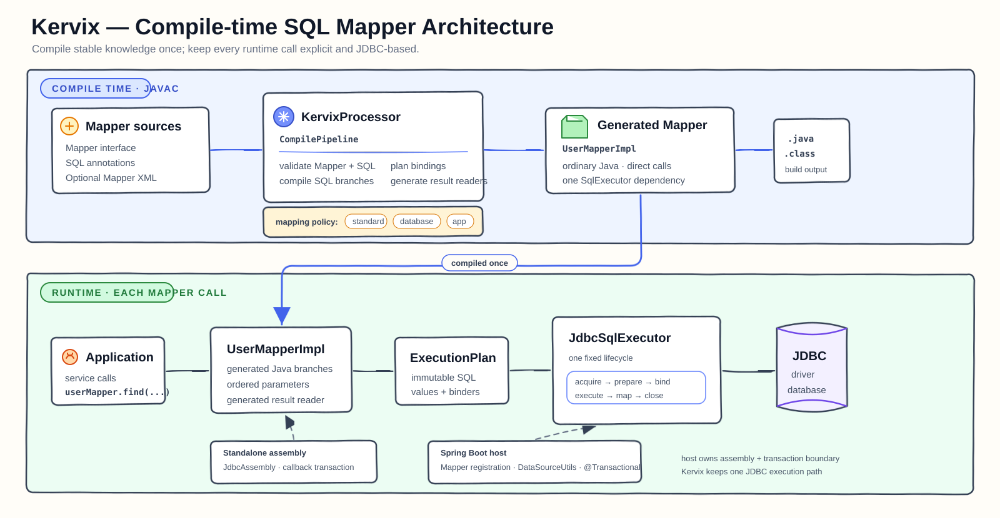

# Kervix

[Chinese](README_cn.md)

Kervix is a lightweight, compile-time SQL Mapper for Java 21. It generates ordinary Java implementations from Mapper interfaces, annotations, and optional XML, then executes immutable plans through an explicit JDBC runtime.

Kervix is not a feature-for-feature MyBatis clone. It focuses on explicit SQL, compile-time diagnostics, readable generated code, deterministic JDBC behavior, and a small runtime without Mapper proxies or runtime XML interpretation.

## Design at a Glance



- Mapper validation, dynamic SQL compilation, parameter planning, and result-mapping generation happen during javac.
- Generated Mappers are ordinary Java classes and depend on one `SqlExecutor`.
- `JdbcSqlExecutor` owns one statement lifecycle across standalone and Spring use.
- One Mapper belongs to one DataSource domain.
- Standard JDBC values are routed by Core without database-specific mapping artifacts.

Read the [architecture overview](docs/user/architecture.md) and [design philosophy](Design-Philosophy.md) for the complete model.

## Modules

| Module | Responsibility |
| --- | --- |
| `kervix-core` | Runtime annotations, generated Mapper contracts, execution plans, and standalone JDBC runtime |
| `kervix-processor` | Annotation processor, SQL compilation, validation, and source generation |
| `kervix-spring-boot-starter` | Mapper registration, named DataSource binding, and Spring transaction participation |
| `kervix-examples/basic-mapper` | Executable annotation, XML, mapping, transaction, batch, and generated-key examples |
| `kervix-examples/multi-datasource-spring-boot` | Independent Spring Boot example with disjoint Mapper packages and named DataSources |
| `kervix-benchmarks` | Reproducible Direct JDBC, Kervix, and MyBatis JMH fixtures |

## Get Started

Start with the [quick start](docs/user/getting-started.md). It covers dependencies, annotation processing, a minimal Mapper, and Spring or standalone assembly.

```bash
mvn clean test
```

## Documentation

- [User documentation](docs/user/README.md)
- [Mapping guide](docs/user/core/mapping.md)
- [Standalone JDBC](docs/user/core/standalone.md)
- [Spring Boot integration](docs/user/spring/spring-boot.md)
- [Migrating from MyBatis](docs/user/migration/from-mybatis.md)
- [Reference and project documentation](docs/README.md)

The supported behavior is defined by the [Core contract](docs/reference/core-contract.md). Active specifications and implementation work are tracked in GitHub Issues.
