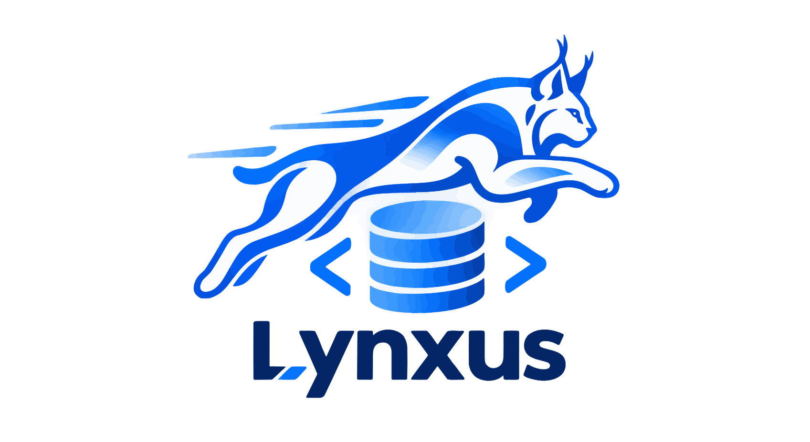
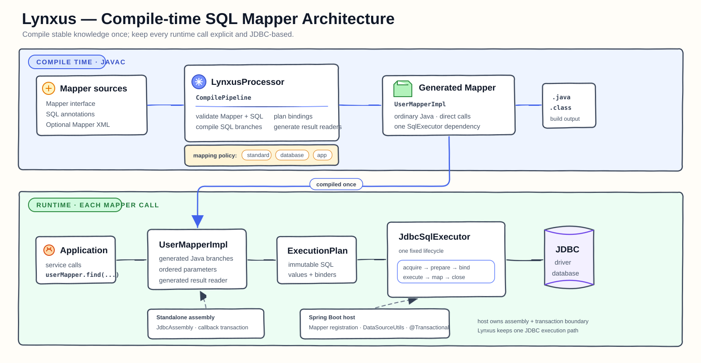

<p align="center">
  
</p>

# Lynxus: AOT-first Compile-time Java ORM

Lynxus is an AOT-first compile-time Java ORM for Java 21 applications. It validates SQL, parameters, dynamic SQL, and result mappings during compilation, then generates ordinary Java implementations with explicit JDBC execution and no runtime Mapper proxies or SQL interpreters. The generated path is suitable for applications targeting GraalVM Native Image or Spring Boot AOT, but neither is required to use Lynxus.

Lynxus is a pragmatic MyBatis alternative for teams that want SQL to remain visible, generated code to remain readable, and JDBC behavior to remain deterministic. It supports annotation-based and XML-based mappings, standalone JDBC, Spring Boot integration, batch operations, generated keys, and typed extension points without requiring a reflection-heavy runtime ORM.

## When to Choose Lynxus

Choose Lynxus when you need:

- compile-time validation for SQL, parameters, dynamic SQL, and result mappings;
- a generated Java ORM path suitable for applications targeting GraalVM Native Image or Spring Boot AOT;
- a MyBatis alternative without runtime XML or OGNL interpretation;
- generated Java Mapper implementations that are easy to inspect and debug;
- an explicit JDBC lifecycle with clear DataSource and transaction ownership;
- standalone JDBC and Spring Boot integration from the same runtime model.

## Quick Start

Lynxus reads Mapper interfaces, annotations, and optional XML during annotation processing. The processor generates a regular Java implementation under `target/generated-sources/annotations`.

```java
import io.github.lynxus.annotation.Mapper;
import io.github.lynxus.annotation.Param;
import io.github.lynxus.annotation.Select;

record User(Long id, String name) {
}

@Mapper
interface UserMapper {

    @Select("SELECT id, name FROM users WHERE id = #{id}")
    User findById(@Param("id") Long id);
}
```

During compilation, Lynxus generates `UserMapperImpl`, which executes through the explicit `SqlExecutor` contract. Start with the [full quick start](docs/user/getting-started.md) for Maven, annotation processor, standalone JDBC, and Spring Boot configuration.

```bash
mvn clean test
```

## Why Lynxus

- **Compile-time first:** Mapper signatures, SQL sources, dynamic SQL, parameter plans, and result mappings fail early through javac diagnostics.
- **Visible generated code:** Generated Mappers are ordinary Java classes instead of runtime proxy objects.
- **Explicit JDBC:** One `SqlExecutor` contract owns statement preparation, binding, execution, result mapping, and cleanup.
- **AOT-friendly runtime:** The generated path can be used in GraalVM Native Image or Spring Boot AOT applications while avoiding runtime SQL interpretation.
- **Spring Boot integration:** Spring owns IoC, DataSource binding, and transaction participation while Lynxus keeps JDBC execution in one lifecycle.
- **Narrow extensions:** Providers, parameter binders, row mappers, and interceptors extend one responsibility without replacing the execution model.

## Design at a Glance



- Mapper validation, dynamic SQL compilation, parameter planning, and result-mapping generation happen during javac.
- Generated Mappers are ordinary Java classes and depend on one `SqlExecutor`.
- `JdbcSqlExecutor` owns one statement lifecycle across standalone and Spring use.
- One Mapper belongs to one DataSource domain.
- Standard JDBC values are routed by Core without database-specific mapping artifacts.

Read the [architecture overview](docs/user/architecture.md) and [design philosophy](Design-Philosophy.md) for the complete model.

For Native Image verification, see [GraalVM Native Image Java ORM usage](docs/user/aot.md). For existing MyBatis projects, see the [MyBatis migration guide](docs/user/migration/from-mybatis.md).

## Modules

| Module | Responsibility |
| --- | --- |
| `lynxus-core` | Runtime annotations, generated Mapper contracts, execution plans, and standalone JDBC runtime |
| `lynxus-processor` | Annotation processor, SQL compilation, validation, and source generation |
| `lynxus-spring-boot-starter` | Mapper registration, named DataSource binding, and Spring transaction participation |
| `lynxus-examples/basic-mapper` | Executable annotation, XML, mapping, transaction, batch, and generated-key examples |
| `lynxus-examples/multi-datasource-spring-boot` | Independent Spring Boot example with disjoint Mapper packages and named DataSources |
| `lynxus-benchmarks` | Reproducible Direct JDBC, Lynxus, and MyBatis JMH fixtures |

## Documentation

- [Quick start](docs/user/getting-started.md): dependencies, annotation processing, a first Mapper, and runtime assembly.
- [Architecture](docs/user/architecture.md): compile-time generation and the fixed JDBC lifecycle.
- [GraalVM Native Image](docs/user/aot.md): AOT-first compilation and Native Image verification.
- [Spring Boot integration](docs/user/spring/spring-boot.md): Mapper registration, DataSource binding, and transactions.
- [Mapping guide](docs/user/core/mapping.md): standard JDBC routing, result mapping, binders, and row mappers.
- [Migrating from MyBatis](docs/user/migration/from-mybatis.md): supported patterns and explicit compatibility boundaries.
- [Reference and project documentation](docs/README.md): stable contracts, compatibility, ADRs, benchmarks, and contributor guidance.

The supported behavior is defined by the [Core contract](docs/reference/core-contract.md). Active specifications and implementation work are tracked in GitHub Issues.
