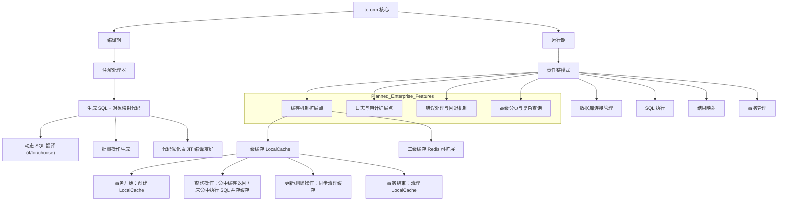

# lite-orm


## `lite-orm` 架构介绍与愿景
## 核心理念
- 编译期生成 SQL + 对象映射 → 消除运行时反射
- 运行期通过责任链处理 ORM 操作 → 高扩展、高可控
- 支持 MyBatis 注解/ XML 风格，平滑迁移
- 高性能、可扩展、易维护，适合企业级应用

### 目标与愿景

我们的目标是打造一个高性能、高扩展性、易于使用的 Java ORM 框架，成为 MyBatis 的有力替代品。

* **性能卓越**：通过消除运行时反射和解析，`lite-orm` 能够充分利用 **JIT 编译器**的优化，提供**接近原生 JDBC 的性能**。
* **高度可扩展**：基于责任链模式，开发者可以轻松地添加自定义功能，如缓存、SQL 审计、自定义数据源等，而无需修改框架核心。
* **简洁易用**：通过编译期生成代码，开发者可以享受高度扩展和极致性能的便利。同时，我们支持 MyBatis 风格的注解和 XML，为开发者提供平滑的迁移体验。
* **未来展望**：`lite-orm` 旨在成为一个社区驱动的开源项目。未来我们将支持更多数据库，引入更高级的查询语言，并持续优化性能，将其打造成 Java ORM 领域的下一个标杆。


---
## 模块总览



## 核心模块设计

### 1. 编译期

> 解析 XML 建议引用开源成熟的库，而不是用正则
> Java 模板生成使用 freemarker

| 模块           | 功能                                  |
| ------------ | ----------------------------------- |
| 注解处理器        | 扫描注解、XML、接口方法                       |
| SQL & 对象映射生成 | 生成纯 Java SQL 执行和对象映射逻辑              |
| 动态 SQL 翻译    | 将 if/for/choose 等标签翻译成 Java 条件分支和循环 |
| 批量操作生成       | 支持批量插入、更新、删除的高性能 SQL                |
| 代码优化         | 保证生成代码 JIT 友好、无反射开销                 |


### 2. 运行期（责任链模式）

责任链流程：
```
[ORM 操作/事务开始]
   │
   ├─ 数据库连接管理
   ├─ SQL 执行
   ├─ 结果映射
   ├─ 事务管理
   ├─ 缓存机制
   ├─ 日志/审计
   └─ 错误处理/回退
```

- 每个环节职责：
    > 这些环节都要以接口形式支持SPI，方便用户SPI扩展
    1. 连接管理：获取、回收连接，支持多数据源
    2. SQL 执行：执行预编译 SQL 或批量操作
    3. 结果映射：将 ResultSet 映射为 Java 对象，支持延迟加载
    4. 事务管理：支持自身或 Spring 托管事务，支持嵌套事务.(此项目设计接口，实现自身管理事务， 未来会在 liteorm-spring-boot-starter里面适配 Spring 事务)
    5. 缓存机制：一级缓存（LocalCache， use caffeine cache）+ 二级缓存（Redis 可扩展） 一二级缓存用户都可以实现接口自定义扩展
    6. 日志/审计：SQL 执行日志、慢查询、操作审计
    7. 错误处理/回退：统一异常体系、回滚策略、可扩展插件
    8. 高级分页/复杂查询：类型安全 API 支持分页、排序、关联查询

---

### 3. 缓存设计

**一级缓存：**
    
    - 生命周期：事务/操作链内
    - 作用：事务内对象一致性、避免重复查询
    - 自动清理：事务结束自动清理

**二级缓存：**

    - 生命周期：跨事务、应用级别或分布式
    - 可扩展至 Redis 或其他分布式缓存
    - 热点数据缓存，降低 DB 压力

**缓存策略：**

    - 查询命中返回缓存
    - 更新/删除同步更新或清理缓存
    - 可扩展 TTL、Evict 策略

### 4. 事务管理

> 此项目设计接口，实现自身管理事务， 未来会在 liteorm-spring-boot-starter里面适配 Spring 事务

**支持方式：**

    - 本地事务：框架内部管理
    - 托管事务：支持 Spring @Transactional

**特性：**

    - 嵌套事务处理
    - 异常回滚策略统一
    - 与缓存协同工作（一级缓存生命周期绑定事务）

### 5. 高级分页与复杂查询

    - 提供通用分页接口
    - 支持类型安全的查询 API
    - 支持关联查询（JOIN 映射）、排序、过滤
    - 可以结合一级/二级缓存优化热点分页数据


### 6. 错误处理与回退

- 标准化异常体系：
  
    - 数据库异常 → LiteOrmException
    - SQL 错误 → SqlExecutionException
    - 事务异常 → TransactionException

- 回退策略：

    - 事务失败时自动回滚
    - 缓存同步清理
    - 可扩展插件处理特殊异常

### 7. 日志与审计

    - SQL 执行日志（可选详细模式）
    - 慢查询监控
    - 操作审计（用户、时间、操作类型）
    - 插件化设计，可替换为 ELK、Prometheus 等系统

### 8. 分库分表

    - 支持多数据源配置

    - 可扩展路由策略（按表、按库、读写分离）

    - 与事务和缓存协同工作

    - 分布式系统友好

### 9. 插件与扩展机制
> 生命周期中在[有意义]的地方充分预留的扩展点，让用户感受到可以像组装高达一样来玩转框架。可以借鉴 Spring
 
- 责任链可插拔：
    - 缓存策略
    - 日志/审计
    - 错误处理
    - 分库分表路由
- 编译期可增加自定义代码生成插件（我们默认使用 freemarker 要以接口方式扩展点，用户甚至可以自定义为其它 velocity,  ）
- 设计保证核心轻量，扩展不修改核心

### 10. 建议优先级

| 功能 | 当前状态 | 建议优先级 | 说明 |
|------|----------|------------|------|
| **编译期代码生成核心** | ✅ **基本完成** | 🔥 **极高** | DynamicSqlParser、TypeInferenceEngine已突破，需完善XML支持 |
| **运行期责任链核心** | ✅ **基本完成** | 🔥 **极高** | 5个核心处理器已实现，需集成测试验证 |
| **完整端到端测试** | ❌ **未开始** | 🔥 **极高** | 验证从@Mapper到生成代码的完整流程 |
| **批量操作生成** | ❌ **未实现** | 🔥 **高** | @Insert、@Update、@Delete的批量SQL生成 |
| **XML配置支持** | ❌ **未实现** | 🔥 **高** | 编译期XML解析，与注解统一处理 |
| **错误处理 & 回退** | ⚠️ **部分** | 📋 **高** | 异常体系完善，回退策略标准化 |
| **高级分页/复杂查询** | ❌ **未实现** | 📋 **中** | 企业级查询API，可在核心稳定后开发 |
| **一级缓存** | ❌ **规划中** | 📋 **中** | 设计扩展点，可选功能 |
| **二级缓存** | ❌ **规划中** | 📋 **中** | Redis扩展，企业特性 |
| **分库分表** | ❌ **规划中** | 📋 **中** | 大型系统特性，预留扩展点 |
| **SQL 审计 & 日志** | ❌ **未实现** | 📋 **低** | 插件化实现，调试辅助 |
| **IDE / 文档 / 社区支持** | ⚠️ **部分** | 📋 **低** | 用户体验优化，非核心阻塞 |

