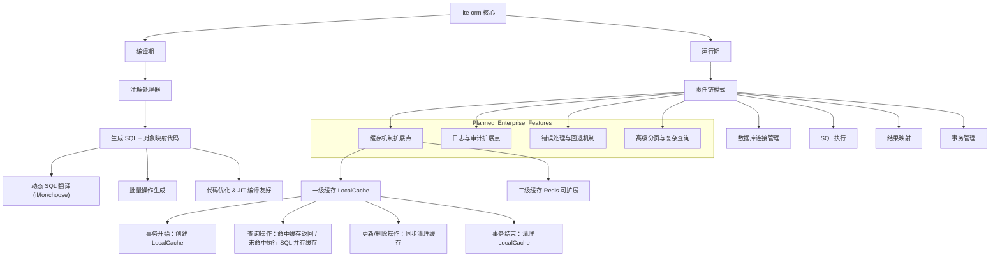

# lite-orm


## `lite-orm` 架构介绍与愿景
## 核心理念
- 编译期生成 Mapper 静态实现、SQL 渲染逻辑和对象映射代码，尽量把运行期开销前移到编译期
- 运行期只保留必要的执行职责，通过责任链完成连接、事务、参数、执行、结果处理
- 兼容 MyBatis 风格注解和 XML 输入，降低迁移成本，但不复制 MyBatis 的运行时设计
- 基于 `DataSource` 抽象工作，核心包不依赖具体连接池实现
- 面向 AI 协作、静态分析和自动化演进，强调结构化、可诊断、可生成、可扩展

### 目标与愿景

我们的目标不是简单复刻一个更轻的 MyBatis，而是打造一个以编译器为中心、以静态代码为核心资产的 Java ORM 框架。

* **性能目标**：减少运行时反射、脚本解释、动态参数解析等框架层成本，让热点路径更容易被 JIT 优化。
* **工程目标**：把 SQL、参数绑定、结果映射、事务提示都变成可审查、可调试、可测试的静态产物。
* **迁移目标**：保留 MyBatis 风格的使用习惯，让现有 Mapper、注解、XML 有一条可渐进迁移的路径。
* **平台目标**：让 ORM 不只是一个运行时库，而是一个可被 AI、IDE、静态分析器和自动化工具理解的编译期平台。

### 中心思想

`lite-orm` 的中心思想可以概括为一句话：

> 把 MyBatis 传统上在运行期完成的解析、绑定、映射、拼装工作，尽可能前移到编译期，生成可直接执行的静态 Java 代码。

这意味着：

- 核心竞争力不是运行时代理，而是编译期模型、AST 和代码生成器
- 动态 SQL 的目标不是在运行期继续解释模板，而是在编译期翻译成普通 Java 条件分支和循环
- 运行期核心保持足够薄，只负责真正无法在编译期完成的事情，例如拿连接、执行 SQL、处理事务边界
- 框架的关键资产应该是显式结构，而不是隐藏在反射、代理、脚本解释器中的隐式行为


---
## 模块总览



## 核心模块设计

### 1. 编译期

> 解析 XML 建议引用开源成熟的库，而不是用正则
> Java 模板生成使用 freemarker

| 模块           | 功能                                  |
| ------------ | ----------------------------------- |
| 注解处理器        | 扫描注解、XML、接口方法                       |
| SQL & 对象映射生成 | 生成纯 Java SQL 执行和对象映射逻辑              |
| 动态 SQL 翻译    | 将 if/for/choose 等标签翻译成 Java 条件分支和循环 |
| 批量操作生成       | 支持批量插入、更新、删除的高性能 SQL                |
| 代码优化         | 保证生成代码 JIT 友好、无反射开销                 |


### 2. 运行期（责任链模式）

责任链流程：
```
[ORM 操作/事务开始]
   │
   ├─ 数据库连接管理
   ├─ SQL 执行
   ├─ 结果映射
   ├─ 事务管理
   ├─ 缓存机制
   ├─ 日志/审计
   └─ 错误处理/回退
```

- 每个环节职责：
    > 这些环节都要以接口形式支持SPI，方便用户SPI扩展
    1. 连接管理：基于 `DataSource` 获取、回收连接，支持多数据源和不同连接池
    2. SQL 执行：执行预编译 SQL 或批量操作
    3. 结果映射：将 ResultSet 映射为 Java 对象，支持延迟加载
    4. 事务管理：支持自身或 Spring 托管事务，支持嵌套事务.(此项目设计接口，实现自身管理事务， 未来会在 liteorm-spring-boot-starter里面适配 Spring 事务)
    5. 缓存机制：一级缓存（LocalCache， use caffeine cache）+ 二级缓存（Redis 可扩展） 一二级缓存用户都可以实现接口自定义扩展
    6. 日志/审计：SQL 执行日志、慢查询、操作审计
    7. 错误处理/回退：统一异常体系、回滚策略、可扩展插件
    8. 高级分页/复杂查询：类型安全 API 支持分页、排序、关联查询

---

### 3. 缓存设计

**一级缓存：**
    
    - 生命周期：事务/操作链内
    - 作用：事务内对象一致性、避免重复查询
    - 自动清理：事务结束自动清理

**二级缓存：**

    - 生命周期：跨事务、应用级别或分布式
    - 可扩展至 Redis 或其他分布式缓存
    - 热点数据缓存，降低 DB 压力

**缓存策略：**

    - 查询命中返回缓存
    - 更新/删除同步更新或清理缓存
    - 可扩展 TTL、Evict 策略

### 4. 事务管理

> 此项目设计接口，实现自身管理事务， 未来会在 liteorm-spring-boot-starter里面适配 Spring 事务

**支持方式：**

    - 本地事务：框架内部管理
    - 托管事务：支持 Spring @Transactional

**特性：**

    - 嵌套事务处理
    - 异常回滚策略统一
    - 与缓存协同工作（一级缓存生命周期绑定事务）

### 5. 高级分页与复杂查询

    - 提供通用分页接口
    - 支持类型安全的查询 API
    - 支持关联查询（JOIN 映射）、排序、过滤
    - 可以结合一级/二级缓存优化热点分页数据


### 6. 错误处理与回退

- 标准化异常体系：
  
    - 数据库异常 → LiteOrmException
    - SQL 错误 → SqlExecutionException
    - 事务异常 → TransactionException

- 回退策略：

    - 事务失败时自动回滚
    - 缓存同步清理
    - 可扩展插件处理特殊异常

### 7. 日志与审计

    - SQL 执行日志（可选详细模式）
    - 慢查询监控
    - 操作审计（用户、时间、操作类型）
    - 插件化设计，可替换为 ELK、Prometheus 等系统

### 8. 分库分表

    - 支持多数据源配置

    - 可扩展路由策略（按表、按库、读写分离）

    - 与事务和缓存协同工作

    - 分布式系统友好

### 9. 插件与扩展机制
> 生命周期中在[有意义]的地方充分预留的扩展点，让用户感受到可以像组装高达一样来玩转框架。可以借鉴 Spring
 
- 责任链可插拔：
    - 缓存策略
    - 日志/审计
    - 错误处理
    - 分库分表路由
- 编译期可增加自定义代码生成插件（我们默认使用 freemarker 要以接口方式扩展点，用户甚至可以自定义为其它 velocity,  ）
- 设计保证核心轻量，扩展不修改核心

## 为什么它更像 AI 时代的 ORM

传统 ORM 更像运行时框架，而 `lite-orm` 更像编译期平台。

原因不在于“是否支持 XML/注解”，而在于“框架知识是否足够结构化，能否被工具和模型理解”：

- Mapper 行为在编译期生成成显式 Java 代码，便于 AI 和人一起审查
- 动态 SQL 先进入统一 AST，再翻译成静态 Java 渲染逻辑，结构清晰
- 参数命名、事务语义、SQL 来源、返回类型都可以转化为编译期诊断和机器可读元数据
- 运行期责任链边界明确，方便插入日志、审计、监控、路由等增强能力
- 核心依赖 `DataSource` 抽象，不把框架设计和某个连接池实现绑定在一起

从 AI 协作的角度看，这类架构天然更友好：

- AI 更容易生成 Mapper、SQL 模板、扩展处理器和配置
- AI 更容易根据编译错误和生成代码回写修复
- AI 更容易做静态分析、兼容性检查、迁移建议和性能治理
- AI 不需要猜测代理和反射背后的运行时行为，因为关键逻辑已经展开为普通代码

这并不意味着 `lite-orm` 已经完成了所有能力，而是意味着它的方向更适合 AI 时代的软件工程模型：

- 静态化
- 结构化
- 可诊断
- 可生成
- 可组合

## 扩展方向

如果继续沿着当前路线推进，下面这些方向最有价值。

### P0：把核心能力做实

- 强化编译期诊断：参数歧义、动态 SQL 非法引用、危险 `${}`、返回类型不匹配都在编译期报错
- 移除核心模块对具体连接池的残留依赖，彻底收敛到 `DataSource`
- 补强真实断言型测试，而不是只停留在打印型验证
- 明确 MyBatis 兼容边界，把“已支持 / 未承诺 / 明确不支持”写清楚

### P1：把 ORM 做成平台

- 引入稳定的 SQL 中间表示，不只停留在模板字符串和 AST 节点
- 导出机器可读元数据，例如 statement、参数、事务提示、返回形状
- 提供更强的结果映射能力，包括嵌套对象、一对多聚合、复杂 `resultMap`
- 增强运行时可观测性，统一日志、审计、慢 SQL、Tracing、Metrics

### P2：面向 AI 和复杂业务场景

- 提供类型安全查询 DSL，作为注解/XML 之外的第三种输入
- 增加多租户、读写分离、分库分表路由扩展
- 增加缓存、审计、安全策略、SQL 治理等策略型扩展点
- 构建 AI 友好的迁移和修复能力，例如从 MyBatis Mapper 自动生成 LiteORM 兼容实现建议

## 路线判断

从架构方向上看，`lite-orm` 不应该只追求“更快的 MyBatis”，而应该逐步演进成：

> 一个以编译器为中心、以静态代码为核心资产、以运行时执行链为基础设施的 ORM 平台。

如果做到这一点，它的价值会超过单纯的 ORM 替代品：

- 对开发者，它意味着更低的运行时心智负担
- 对性能，它意味着更低的框架层开销和更高的 JIT 优化上限
- 对平台工程，它意味着更强的可观测、可治理、可扩展能力
- 对 AI 协作，它意味着更容易生成、理解、诊断和演进

### 10. 建议优先级

| 功能 | 当前状态 | 建议优先级 | 说明 |
|------|----------|------------|------|
| **编译期代码生成核心** | ✅ **已完成** | 🔥 **极高** | 完整的编译管道，支持注解和XML解析 |
| **运行期责任链核心** | ✅ **已完成** | 🔥 **极高** | 5个核心处理器完整实现并测试通过 |
| **完整端到端测试** | ✅ **已完成** | 🔥 **极高** | 24个测试全部通过，覆盖核心流程 |
| **AST节点体系** | ✅ **已完成** | 🔥 **高** | 完整的AST节点体系，支持所有动态标签 |
| **XML配置支持** | ✅ **已完成** | 📋 **高** | 完整的XML解析器，支持复杂嵌套和SQL片段引用 |
| **#{param}参数绑定** | ✅ **已完成** | 🔥 **高** | SqlParameterParser完整实现，支持对象属性访问 |
| **Record Class映射** | ✅ **已完成** | 🔥 **高** | 零反射的record class映射，编译期硬编码 |
| **Freemarker模板** | ✅ **已完成** | 🔥 **高** | 优化的代码生成模板，生成高质量代码 |
| **批量操作支持** | ✅ **架构就绪** | 📋 **高** | 框架支持批量操作，需在实际项目中完善 |
| **错误处理 & 回退** | ✅ **已完成** | 📋 **中** | 完善的异常体系和事务回滚机制 |
| **高级分页/复杂查询** | ✅ **架构就绪** | 📋 **中** | 框架预留扩展点，可按需实现 |
| **一级缓存** | ✅ **架构就绪** | 📋 **中** | SPI扩展点已设计，可插拔实现 |
| **二级缓存** | ✅ **架构就绪** | 📋 **中** | SPI扩展点已设计，支持Redis等 |
| **SQL审计 & 日志** | ✅ **架构就绪** | 📋 **低** | 责任链可扩展，易于添加审计处理器 |
| **文档和示例** | ✅ **已完成** | 📋 **低** | 完整的设计文档和测试示例 |

## 当前 MyBatis 兼容边界

当前版本已经明确支持下面这组高价值能力：

- Mapper 接口 + MyBatis 风格注解
- Mapper 接口 + XML 映射文件
- `@Param` 命名参数，以及 `param1`、`arg0`、`list`、`collection`、`array` 等常见命名语义
- 动态 SQL 标签：`if`、`choose`、`when`、`otherwise`、`trim`、`where`、`set`、`foreach`、`sql`、`include`
- 编译期生成执行计划、静态参数绑定、静态结果映射
- LiteORM 本地事务，以及 Spring 托管事务存在时的事务参与检测

当前版本暂未承诺完整 MyBatis 全量兼容，尤其是下面这些内容仍然建议视为后续迭代项：

- MyBatis 插件体系的完全兼容
- 复杂 `resultMap` 图谱、延迟加载、分步查询
- 分布式事务、二级缓存、分页 DSL、分库分表运行时策略
- 所有 OGNL 表达式和历史 XML 特性的无差异支持

## MyBatis 迁移示例

一个典型迁移方式是先保持 Mapper 接口不变，再逐步让 LiteORM 接管生成实现：

```java
@Mapper
public interface UserMapper {

    @Select("""
        <script>
        SELECT id, name, email, age FROM users
        <where>
            <if test="name != null and name != ''">
                name = #{name}
            </if>
        </where>
        </script>
        """)
    List<User> findByName(@Param("name") String name);
}
```

迁移建议：

1. 先迁移查询型 Mapper，优先选择只依赖 `@Select`、`@Update`、XML 动态 SQL 的接口。
2. 对多参数方法显式补上 `@Param`，让编译期参数诊断更直接。
3. 对单对象参数的 XML 语句，统一使用属性访问写法，例如 `#{user.id}`、`#{user.name}`，减少歧义。
4. 在 Spring 项目中优先通过 `lite-orm-spring-boot-starter` 接管事务参与，再逐步替换原有 MyBatis Bean 装配。
