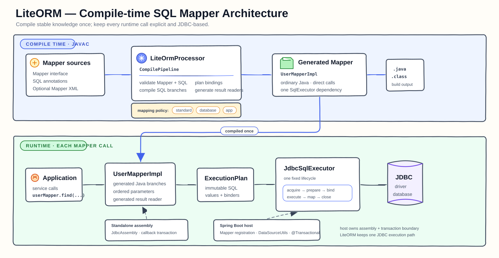

# LiteORM

[English](README.md)

LiteORM 是一个面向 Java 21 的轻量级编译期 SQL Mapper。它在 javac 注解处理阶段读取 Mapper 接口、SQL 注解和可选 XML，生成普通 Java 实现，再通过明确、固定的 JDBC 生命周期执行不可变计划。

LiteORM 不追求完整复刻 MyBatis。它关注显式 SQL、编译期诊断、可读的生成代码、确定性的 JDBC 行为，以及不依赖 Mapper 代理和运行期 XML 解释的小型运行时。

## 顶层设计



- Mapper 校验、动态 SQL 编译、参数规划和结果映射生成发生在 javac 阶段。
- 生成的 Mapper 是普通 Java 类，只依赖一个 `SqlExecutor`。
- Standalone 与 Spring 共用同一个 `JdbcSqlExecutor` 执行生命周期。
- 一个 Mapper 只属于一个 DataSource 域。
- PostgreSQL 和 MySQL 映射是显式选择的编译期依赖，不是运行期注册表。

完整模型见英文的[架构概览](docs/user/architecture.md)和[设计哲学](Design-Philosophy.md)。

## 模块

| 模块 | 职责 |
| --- | --- |
| `lite-orm-core` | 注解、处理器、生成 Mapper 契约和 Standalone JDBC 运行时 |
| `lite-orm-spring-boot-starter` | Mapper 注册、命名 DataSource 绑定和 Spring 事务参与 |
| `lite-orm-postgresql-types` | PostgreSQL 官方完整 JDBC 类型映射 |
| `lite-orm-mysql-types` | MySQL 官方完整 JDBC 类型映射 |
| `lite-orm-examples/basic-mapper` | 可运行的注解、XML、映射、事务、批处理和生成键示例 |
| `lite-orm-benchmarks` | Direct JDBC、LiteORM 和 MyBatis 的可复现 JMH 基准 |

## 开始使用

请从英文的[快速开始](docs/user/getting-started.md)进入，其中包括依赖配置、注解处理、包级 JDBC 映射选择、最小 Mapper，以及 Spring 或 Standalone 装配。

```bash
mvn clean test
```

## 文档

- [用户文档](docs/user/README.md)
- [值映射与行映射](docs/user/core/mapping.md)
- [Standalone JDBC](docs/user/core/standalone.md)
- [Spring Boot 集成](docs/user/spring/spring-boot.md)
- [PostgreSQL 类型映射](docs/user/database-types/postgresql.md)
- [MySQL 类型映射](docs/user/database-types/mysql.md)
- [从 MyBatis 迁移](docs/user/migration/from-mybatis.md)
- [参考与项目文档索引](docs/README.md)

除本入口文件外，其他文档暂时只维护英文版本。稳定行为以英文的[Core 契约](docs/reference/core-contract.md)为准；进行中的规格与实现任务由 GitHub Issues 跟踪。
