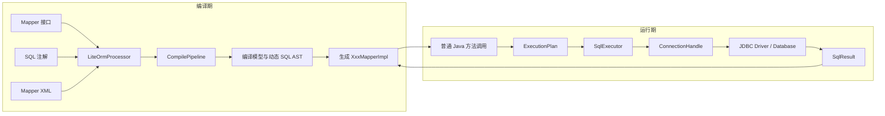
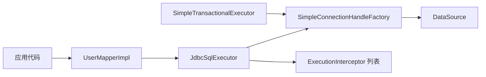
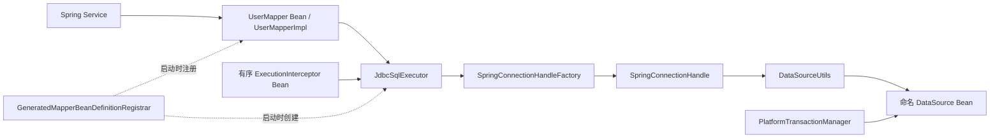

# LiteORM

LiteORM 是一个面向 Java 的编译期 ORM：在 javac 注解处理阶段读取 Mapper 接口、SQL 注解和 Mapper XML，生成普通 Java `*MapperImpl`，把 SQL 渲染、参数顺序和结果映射尽可能前移到编译期。

它的目标不是复刻完整 MyBatis，而是提供一条更静态、更透明的 Mapper 执行路径：

- Mapper 调用不经过运行期代理和反射分发；
- 常见动态 SQL 被编译为生成代码中的 Java 分支和循环；
- 生成 Mapper 只依赖一个 `SqlExecutor`；
- core 保持 Spring-neutral，可独立使用，也可接入 Spring Boot；
- 一个 Mapper 只属于一个 DataSource 域，多 DataSource 使用互不重叠的 Mapper 包。

当前版本要求 Java 21。首个 GA 的稳定范围见 [Core GA 契约](docs/core-ga-contract.md)。

## Quick Start

下面先以 Spring Boot 应用为例完成最小接入。Standalone JDBC 装配见后文。

### 1. 添加依赖

```xml
<dependency>
    <groupId>org.liteorm</groupId>
    <artifactId>lite-orm-spring-boot-starter</artifactId>
    <version>1.0.0-SNAPSHOT</version>
</dependency>
```

当前仓库版本尚为 SNAPSHOT；在本仓库中开发或运行外部示例前，可先安装到本地 Maven 仓库：

```bash
mvn -DskipTests install
```

建议显式启用 LiteORM 注解处理器：

```xml
<plugin>
    <groupId>org.apache.maven.plugins</groupId>
    <artifactId>maven-compiler-plugin</artifactId>
    <configuration>
        <proc>full</proc>
        <annotationProcessors>
            <annotationProcessor>org.liteorm.compile.LiteOrmProcessor</annotationProcessor>
        </annotationProcessors>
    </configuration>
</plugin>
```

### 2. 定义结果类型和 Mapper

```java
package com.example.user.mapper;

public record User(Long id, String name, String email, Integer age) {
}
```

```java
package com.example.user.mapper;

import org.liteorm.annotation.Insert;
import org.liteorm.annotation.Mapper;
import org.liteorm.annotation.Param;
import org.liteorm.annotation.Select;

@Mapper
public interface UserMapper {

    @Insert("INSERT INTO users (id, name, email, age) "
        + "VALUES (#{id}, #{name}, #{email}, #{age})")
    int insert(
        @Param("id") Long id,
        @Param("name") String name,
        @Param("email") String email,
        @Param("age") Integer age
    );

    @Select("SELECT id, name, email, age FROM users WHERE id = #{id}")
    User findById(@Param("id") Long id);
}
```

编译后会生成：

```text
target/generated-sources/annotations/com/example/user/mapper/UserMapperImpl.java
```

`UserMapperImpl` 是普通 Java 类，直接实现 `UserMapper`，构造器只接收一个 `SqlExecutor`。生成类不包含 `@Component`、`@Autowired` 或其他 Spring 注解。

### 3. 显式绑定 Mapper 包和 DataSource

```yaml
lite-orm:
  mapper-bindings:
    - package-name: com.example.user.mapper
      data-source: dataSource
```

- `package-name` 是需要注册的生成 Mapper 所在包。
- `data-source` 是 Spring 容器中 DataSource Bean 的名字。
- 即使应用只有一个 DataSource，也保留这两个显式配置项。

Starter 会扫描该包中的生成实现，使用 Mapper 接口的默认 JavaBeans 名称注册 Bean。例如 `UserMapper` 注册为 `userMapper`，`URLMapper` 保持为 `URLMapper`。

### 4. 注入并调用 Mapper

```java
@Service
public class UserService {

    private final UserMapper userMapper;

    public UserService(UserMapper userMapper) {
        this.userMapper = userMapper;
    }

    @Transactional
    public User createAndLoad(User user) {
        userMapper.insert(user.id(), user.name(), user.email(), user.age());
        return userMapper.findById(user.id());
    }
}
```

Spring 事务必须使用与该 Mapper 所绑定 DataSource 对应的 `PlatformTransactionManager`。单 DataSource 应用通常由 Spring Boot 自动配置；多 DataSource 应用应显式选择正确的事务管理器。

可运行的完整示例见 [basic-mapper](lite-orm-examples/basic-mapper/README.md)。

## 整体设计

LiteORM 把 Mapper 的“理解过程”放在编译期，把 JDBC 的“物理执行过程”保留在运行期。



### 编译期负责什么

- 校验 Mapper 方法、参数和返回类型；
- 解析 `@Select`、`@Insert`、`@Update`、`@Delete`、`@Batch` 和 Mapper XML；
- 把受支持的动态 SQL 标签和表达式编译为 Java；
- 确定参数引用、绑定顺序、SQL 来源和 statement 类型；
- 生成标量、record、JavaBean、集合、游标、批处理和 generated key 返回代码；
- 对不支持的表达式、签名和映射尽量在编译期给出定位明确的诊断。

### 运行期负责什么

- 根据生成的 `ExecutionPlan` 获取连接；
- 创建和配置 JDBC statement；
- 按既定顺序绑定参数；
- 执行 SQL、读取结果和释放资源；
- 参与 standalone 或 Spring 管理的事务；
- 在固定执行边界通知 `ExecutionInterceptor`。

运行期不会重新读取 Mapper XML，不执行 OGNL、MVEL 或 SpEL，也不通过 Mapper 代理查找目标方法。

## 完整角色表

| 职责 | Core / Standalone | Spring Boot 接入 | 边界结论 |
| --- | --- | --- | --- |
| Mapper 声明 | 应用编写 `@Mapper` 接口 | 使用同一接口 | **完全复用** |
| 编译期处理 | `LiteOrmProcessor`、内部 `CompilePipeline` | 使用同一注解处理器和生成结果 | **完全复用；Spring 不参与编译** |
| 生成 Mapper | 应用手工 `new XxxMapperImpl(sqlExecutor)` | Registrar 将 `XxxMapperImpl` 注册为 Mapper 接口 Bean | **生成类完全复用；实例创建方式不同** |
| 执行计划 | `ExecutionPlan`、`BatchExecutionPlan` | 使用相同计划 | **完全复用；计划中不保存 DataSource 或 Spring Bean 名** |
| 执行结果 | `SqlResult` | 使用相同结果契约 | **完全复用** |
| SQL 执行入口 | `SqlExecutor` | 生成 Mapper 仍只依赖 `SqlExecutor` | **完全复用** |
| 固定 JDBC 生命周期 | `JdbcSqlExecutor` | `SpringJdbcSqlExecutorFactoryBean` 创建同一个 `JdbcSqlExecutor` | **完全复用；Spring 不重写执行流程** |
| JDBC 组件装配 | `LiteOrm.jdbc(...)`、`JdbcAssembly` | `mapper-bindings`、Registrar、`SpringJdbcSqlExecutorFactoryBean` | **Spring 替代手工装配过程** |
| 连接参与工厂 | `SimpleConnectionHandleFactory` | `SpringConnectionHandleFactory` | **Spring 替代 standalone 实现** |
| 单次连接句柄 | `SimpleTransaction` 或其参与句柄实现 `ConnectionHandle` | `SpringConnectionHandle` 通过 `DataSourceUtils` 获取和释放连接 | **契约复用，实现替换** |
| 事务边界 | `SimpleTransactionalExecutor` 提供本地回调事务 | `PlatformTransactionManager`、`@Transactional` 管理事务 | **Spring 接管事务边界，不注册 standalone executor** |
| 事务连接绑定 | `SimpleConnectionHandleFactory` 使用实例级 `ThreadLocal` | Spring `TransactionSynchronizationManager` 绑定 DataSource 资源 | **Spring 替代线程事务上下文实现** |
| SQL Provider | 生成 Mapper 直接持有 `SqlProvider<P>` | 使用同一生成实例，不自动注册为 Spring Bean | **完全复用** |
| 参数绑定 | 生成 Mapper 持有 `ParameterBinder<T>`，`JdbcSqlExecutor` 调用 | 使用同一 binder | **完全复用** |
| 结果映射 | 生成 Mapper 持有 `RowMapper<T>`，`JdbcSqlExecutor` 调用 | 使用同一 row mapper | **完全复用** |
| 执行观察 | `JdbcAssembly` 显式接收 `ExecutionInterceptor` 列表 | FactoryBean 收集并排序 `ExecutionInterceptor` Bean | **契约和调用时机复用；实例发现交给 Spring** |
| Mapper IOC 注册 | 无；应用自行管理 Mapper 实例 | `GeneratedMapperBeanDefinitionRegistrar` 扫描并注册生成实现 | **仅 Spring 存在** |
| DataSource 路由 | 绑定一个物理或路由 DataSource | 绑定一个命名的物理或路由 DataSource Bean | **路由策略始终属于 DataSource** |

Spring 真正替换的是 standalone 的外围装配与宿主能力：

```text
SimpleConnectionHandleFactory  -> SpringConnectionHandleFactory
SimpleTransaction/参与句柄      -> SpringConnectionHandle + DataSourceUtils
SimpleTransactionalExecutor    -> PlatformTransactionManager + @Transactional
手工创建 Mapper                 -> GeneratedMapperBeanDefinitionRegistrar
显式 interceptor 列表           -> Spring ordered interceptor Beans
```

Spring 不替代生成 Mapper、`ExecutionPlan`、`SqlExecutor`、`JdbcSqlExecutor`、Provider、Binder 或 RowMapper。它接管的是 Bean 创建、连接参与实现、线程事务资源和事务边界。

## 两种装配方式

### Standalone JDBC



```java
JdbcAssembly assembly = LiteOrm.jdbc(dataSource)
    .domain("users")
    .interceptors(interceptors)
    .build();

UserMapper userMapper = new UserMapperImpl(assembly.sqlExecutor());
```

`JdbcAssembly` 是一个 DataSource 域的不可变装配结果：

- `sqlExecutor()` 注入生成 Mapper；
- `transactionalExecutor()` 提供简单本地事务回调；
- 回调外的 Mapper 调用使用独立 auto-commit 连接句柄；
- 同一 assembly 的事务回调内，Mapper 调用共享线程绑定的根事务。

### Spring Boot



Starter 对每个命名 DataSource 创建一个 Spring-aware `SqlExecutor`，并把它构造器注入到对应包下的生成 Mapper。Mapper 调用时不会再次扫描包、查找 Bean 或选择 DataSource。

## SQL 与映射能力

### SQL 来源

支持以下 Mapper SQL 来源：

- `@Select`、`@Insert`、`@Update`、`@Delete`；
- `@Batch` JDBC 批处理；
- Mapper XML；
- `@UseSqlProvider` 运行时 SQL 逃生口。

同一个 Mapper 方法同时存在 XML statement 和 SQL 注解时：

1. XML 优先；
2. 生成代码只使用 XML；
3. javac 在对应 Mapper 方法位置输出 warning。

LiteORM 不在运行期加载或重新解释 XML。

### 动态 SQL

当前支持：

- `if`；
- `choose`、`when`、`otherwise`；
- `trim`、`where`、`set`；
- `foreach`；
- `bind`；
- `sql`、`include`。

这些标签和受控的 OGNL 风格表达式会被编译为原生 Java。任意方法调用、静态方法访问、不支持的表达式和不安全 `${...}` 替换会直接编译失败。

普通可选条件优先使用编译期动态 SQL。只有 SQL 结构确实必须在运行时决定时，才使用 `SqlProvider`。

### 参数

- 推荐为多参数方法显式声明 `@Param`；
- 支持声明参数名、`param1`、`arg0`、`list`、`collection`、`array` 等约定名称；
- 属性路径在编译期解析并生成直接 Java 访问；
- null 值使用 JDBC `setNull`；
- varargs、静态 Mapper 方法和无法解析的泛型签名会编译失败。

### 返回类型

SELECT 支持：

- 标量类型；
- record；
- JavaBean；
- 单对象；
- `Optional<T>`；
- `List<T>`；
- `void` + `CursorCallback<T>` 流式消费。

写操作支持更新计数、JDBC batch 的原始 `int[]`，以及使用 `@GeneratedKey("column")` 返回一个明确命名的 generated key。

复杂 `resultMap` 图、嵌套集合聚合和延迟加载不属于当前 core 契约。

### 分页与 StatementOptions

真正的分页必须体现在最终 SQL 中，例如数据库方言的 `LIMIT/OFFSET`、`FETCH FIRST` 或等价语句。分页参数可以是动态参数，并由数据库执行有界查询。

`StatementOptions` 提供 JDBC query timeout、fetch size 和 max rows。`maxRows` 只是客户端/JDBC 安全上限，不是真分页，也不能替代最终 SQL 中的分页条件。

## 事务模型

### core 简单本地事务

core 的事务模型与 MyBatis standalone 使用场景类似：提供明确、简单的本地 JDBC 事务，不承担完整企业事务平台职责。

```java
User user = assembly.transactionalExecutor().execute(() -> {
    userMapper.insert(1L, "Alice", "alice@example.com", 30);
    return userMapper.findById(1L);
});
```

- 根回调在当前线程绑定一个本地事务；
- 连接在第一次 Mapper 调用时延迟获取；
- 正常返回时提交一次；
- 异常时按需回滚；
- 嵌套回调加入根事务，不创建独立事务；
- 嵌套调用失败会把根事务标记为 rollback-only，即使业务代码捕获了内部异常，根事务也不会提交部分结果；
- 完成后始终清理线程绑定。

core 不提供传播枚举、savepoint、挂起/恢复、声明式隔离级别、只读事务、分布式提交或恢复机制。

### Spring 事务

Spring Boot 应用使用 Spring 管理事务：

```java
@Transactional(transactionManager = "usersTransactionManager")
public void updateUsers() {
    userMapper.update(...);
}
```

`SpringConnectionHandleFactory` 通过 Spring JDBC 的连接同步机制取得和释放连接。`JdbcSqlExecutor` 仍执行相同 JDBC 生命周期，但 commit/rollback 时机属于对应的 `PlatformTransactionManager`。

## 多 DataSource

LiteORM 的确定性关系是：

```text
一个 Mapper 实例 -> 一个 SqlExecutor -> 一个物理或路由 DataSource
```

多个 DataSource 不是让同一个 Mapper 在调用时动态选择多个 executor，而是为不同 Mapper 包建立独立组件图：

```yaml
lite-orm:
  mapper-bindings:
    - package-name: com.example.user.mapper
      data-source: usersDataSource
    - package-name: com.example.order.mapper
      data-source: ordersDataSource
```

- 每条规则必须同时声明 `package-name` 和 `data-source`；
- Mapper 包必须互不重叠，重复、父包和子包规则都会导致启动失败；
- 一个 Mapper 接口只注册一次，只属于一个 DataSource 域；
- 每个事务边界必须选择同一 DataSource 对应的事务管理器；
- core 不协调多个 DataSource 之间的原子提交。

如果绑定的是 `AbstractRoutingDataSource` 或其他路由 DataSource，它仍然是该 Mapper 唯一绑定的 DataSource。租户、分片、读写路由和物理连接选择属于路由 DataSource 及其事务管理器，不进入 `ExecutionPlan`。

## Spring Boot 接入

### Mapper 如何进入 IOC

生成 `MapperImpl` 时不会写入 `@Component`。Starter 在应用启动阶段：

1. 读取 `lite-orm.mapper-bindings`；
2. 校验包规则和命名 DataSource；
3. 扫描目标包中的 `*MapperImpl`；
4. 验证生成类实现了 `@Mapper` 接口并存在公开 `SqlExecutor` 构造器；
5. 为 DataSource 创建 Spring-aware `SqlExecutor`；
6. 使用构造器注入注册生成 Mapper Bean。

Bean 名使用 Mapper 接口简单类名的 `Introspector.decapitalize` 结果，不需要 `bean-name-prefix`：

```text
UserMapper -> userMapper
OrderMapper -> orderMapper
URLMapper -> URLMapper
```

同名 Mapper Bean、重复包绑定、父子包重叠、DataSource 缺失或生成类结构不合法都会在启动阶段失败，而不是等到第一次 SQL 调用。

### Spring 管理哪些对象

- DataSource 和连接池；
- `PlatformTransactionManager` 及事务边界；
- 生成 Mapper Bean 的创建和依赖注入；
- `ExecutionInterceptor` Bean 的发现与 ordering；
- 路由 DataSource 所需的租户、分片或读写上下文。

Spring 不会把生成 Mapper 替换成代理式 SQL 分发，也不会重写 `JdbcSqlExecutor` 的固定执行阶段。

## 扩展点

所有由生成 Mapper 持有的 Provider、Binder 和 RowMapper 都会被 Mapper Bean 共享。实现应当无状态、线程安全，或者自行保护可变状态。

### SqlProvider

`SqlProvider<P>` 用于编译期动态 SQL 无法自然表达的少数运行时 SQL 结构：

```java
@UseSqlProvider(
    value = UserSearchProvider.class,
    statementType = ExecutionPlan.StatementType.SELECT
)
List<User> search(UserSearch search);
```

Provider 返回包含 SQL 和有序 `BoundParameter` 的 `BoundSql`。它可以服务 SELECT、INSERT、UPDATE 或 DELETE，但每个 Mapper 方法都必须通过 `statementType` 明确语句类型。

当前生成 Mapper 直接通过无参构造器创建 Provider，并以方法名生成字段，例如 `searchSqlProvider`。它不是 Spring Bean，也不是整个 Mapper 的通用 CRUD 执行器。

### ParameterBinder

在 JDBC 默认 `setObject` 无法满足某个 Java 类型时，对 Mapper 参数使用 `@UseParameterBinder`。生成计划携带 binder 的直接引用；参数为 null 时跳过自定义 binder 并绑定 SQL `NULL`。

### RowMapper

当标量、record 或 JavaBean 内建映射无法表达一个单行结果时，在查询方法上使用 `@UseRowMapper`。它只负责一行的结果形状，不提供复杂多行对象图聚合。

### ExecutionInterceptor

`ExecutionInterceptor` 用于日志、指标、追踪、审计、授权和慢查询观察：

- `beforeExecution` 按注册顺序调用；
- `afterSuccess` 和 `afterFailure` 按相反顺序回退；
- 拦截器观察不可变执行信息；
- 拦截器不能替换生成 SQL、参数 binder 或 row mapper；
- 终态回调自身失败不会覆盖原始 SQL 结果或原始异常。

Standalone 通过 `JdbcAssembly.interceptors(...)` 显式传入；Spring Boot 自动收集有序的 `ExecutionInterceptor` Bean。

完整扩展约束见 [扩展契约](docs/extensions.md)。

## MyBatis 兼容与迁移

### 当前支持

- LiteORM 自有 `org.liteorm.annotation` Mapper 注解；
- 注解 SQL 和 Mapper XML；
- 常见动态 SQL 标签和受控表达式子集；
- `@Param` 及常见 fallback 参数名；
- 标量、record、JavaBean、集合和 cursor；
- JDBC batch 和单列 generated key；
- standalone 本地事务与 Spring 事务参与。

### 明确不承诺

- 任意 OGNL 和完整 MyBatis XML 兼容；
- 复杂 `resultMap`、嵌套集合和延迟加载；
- MyBatis 插件运行时；
- 一级/二级缓存语义；
- 内建分页插件或分页 DSL；
- 同一 Mapper 绑定多个 DataSource；
- 运行期 XML reload 或 Mapper 代理；
- 分布式事务和生产级事务策略。

### 推荐迁移顺序

1. 从简单查询和常见动态 SQL Mapper 开始；
2. 将 MyBatis import 替换为 `org.liteorm.annotation`；
3. 为多参数方法补充明确的 `@Param`；
4. 保留受支持的 XML，LiteORM 会在编译期生成 Java；
5. 用 `SqlProvider`、Binder 或 RowMapper 处理少数明确扩展点；
6. 无法落入生成契约的复杂能力保留为显式 JDBC；
7. 检查生成的 `*MapperImpl` 和 javac 诊断，再逐步扩大迁移范围。

详细边界见 [MyBatis 兼容矩阵](docs/mybatis-compatibility.md) 和 [迁移指南](docs/migration-guide.md)。

## 性能基线

仓库包含独立的 `lite-orm-benchmarks` JMH 模块，对比相同 H2 schema 和 SQL 下的 Direct JDBC、LiteORM 与 MyBatis 3.5.19。以下是当前基线的平均耗时，数值越低越好：

| 场景 | Direct JDBC µs/op | LiteORM µs/op | MyBatis µs/op | LiteORM 相对 MyBatis |
| --- | ---: | ---: | ---: | ---: |
| 标量查询 | 2.475 | 3.477 | 4.239 | 快 18.0% |
| record 映射 | 2.940 | 3.916 | 5.803 | 快 32.5% |
| JavaBean 映射 | 2.803 | 3.946 | 5.924 | 快 33.4% |
| 动态 SQL 单行查询 | 25.184 | 27.013 | 28.455 | 快 5.1% |
| Cursor 十行读取 | 3.226 | 3.362 | 8.969 | 快 62.5% |
| 本地事务加标量查询 | 2.680 | 4.146 | 4.284 | 快 3.2% |
| JDBC Batch 100 行 | 40.021 | 41.319 | 71.573 | 快 42.3% |
| Generated key | 2.766 | 3.229 | 4.772 | 快 32.3% |

基线使用 JMH 1.37、H2 2.3.232、JDK 21、2 forks、3 次预热和 5 次测量，并分别采集 GC allocation 与代表性 JFR。它用于观察框架开销，不代表 PostgreSQL/MySQL 网络环境下的业务延迟，也不能单独作为优化依据。

复现命令、分配数据和 JFR 观察见 [Core GA 性能基线](docs/benchmarks/core-ga-baseline.md)。

## 深入文档

- [设计哲学](Design%20Philosophy.md)：项目长期原则、架构边界和明确非目标。
- [文档索引](docs/README.md)：当前契约、指南、证据和活跃路线图入口。
- [Core GA 契约](docs/core-ga-contract.md)：core 首个 GA 的稳定职责和非目标。
- [MyBatis 兼容矩阵](docs/mybatis-compatibility.md)：支持、部分支持和不支持能力。
- [MyBatis 迁移指南](docs/migration-guide.md)：从现有 Mapper 渐进迁移。
- [扩展契约](docs/extensions.md)：Spring 绑定、Provider、Binder、RowMapper 和 Interceptor。
- [Core GA 性能基线](docs/benchmarks/core-ga-baseline.md)：JMH、allocation 和 JFR 数据。
- [Basic Mapper 示例](lite-orm-examples/basic-mapper/README.md)：可执行 Maven consumer。
- [External Maven Processor 示例](lite-orm-examples/external-maven-processor)：独立于根 Maven reactor 的外部注解处理夹具。

项目判断标准保持简单：优先生成可读、可测试、可诊断的静态代码；运行期只保留 ORM 必需的 JDBC 执行职责，其他能力通过明确的宿主边界或类型化扩展接口接入。
