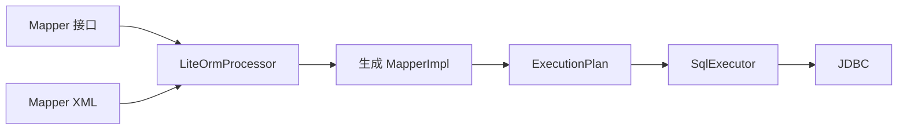

# README 中文版重构设计

## 目标

将 `README_cn.md` 从以项目演进和内部设计为主的说明文档，重构为面向首次使用者和架构评审者的自顶向下入口文档：先完成 Quick Start，再解释编译期架构、运行期角色、两种装配方式、事务、多数据源和 Spring Boot 集成，最后收束扩展点、兼容边界、性能和深入文档。

## 读者路径

README 按以下顺序组织：

1. 用一句话说明 LiteORM 的定位和当前成熟度。
2. 使用最小 Spring Boot 示例完成依赖、Mapper、配置和调用。
3. 通过 Mermaid 图解释编译期生成和运行期执行的整体链路。
4. 使用完整角色表说明每个公开角色属于 core、生成代码还是 Spring。
5. 分别展示 Standalone JDBC 和 Spring Boot 装配后的对象依赖关系。
6. 展开 SQL、映射、事务、多 DataSource、Spring 注册和扩展机制。
7. 最后说明 MyBatis 兼容边界、迁移建议、性能基线和深入文档。

## 信息架构

新版章节固定为：

1. 项目定位
2. Quick Start
3. 整体设计
4. 完整角色表
5. 两种装配方式
6. SQL 与映射能力
7. 事务模型
8. 多 DataSource
9. Spring Boot 接入
10. 扩展点
11. MyBatis 兼容与迁移
12. 性能基线
13. 深入文档

## 内容边界

- README 解释稳定的用户契约，不记录已经完成的实施任务和历史清理过程。
- Quick Start 以 Spring Boot 为默认入口；Standalone JDBC 放在架构之后单独说明。
- 单 DataSource 应用仍显式配置 `package-name + data-source`，不描述不存在的零配置扫描。
- 一个 Mapper 接口只绑定一个 `SqlExecutor`，因而只属于一个 DataSource 域；多个 DataSource 使用互不重叠的 Mapper 包。
- core 只提供简单本地 JDBC 事务；线上 Spring 应用使用对应 DataSource 的 Spring 事务管理器。
- `SqlProvider` 单独列为编译期绑定的低频运行时 SQL 逃生口，不暗示它由 Spring 自动发现或注入。
- 生成 Mapper 是普通 Java 类，不添加 Spring 注解；Starter 通过 BeanDefinition Registrar 扫描并注册生成实现。
- 分页只有最终 SQL 中出现数据库分页语句才是真分页；JDBC 行数限制只作为安全上限，不描述为分页能力。

## 图示设计

整体架构图分为编译期和运行期两部分：

装配图分别展示：

- Standalone：`MapperImpl -> JdbcSqlExecutor -> SimpleConnectionHandleFactory -> DataSource`，事务回调由 `SimpleTransactionalExecutor` 共享同一工厂。
- Spring：`Mapper Bean -> JdbcSqlExecutor -> SpringConnectionHandleFactory -> DataSourceUtils -> DataSource`，事务边界由 Spring `PlatformTransactionManager` 管理。

## 删除与合并

- 删除旧 Engine、processor chain、可变执行上下文等历史清理说明。
- 删除重复出现的核心定位、职责边界和当前状态段落。
- 将 SQL 来源优先级并入“SQL 与映射能力”。
- 将 Provider、Binder、RowMapper、Interceptor 统一收敛到“扩展点”，但保留各自不同的实例生命周期和 Spring 边界。
- 将实现计划从 README 主叙事移出，只在深入文档中保留稳定契约、兼容矩阵、迁移指南、扩展契约和 benchmark 链接。

## 验收标准

- 新用户从 README 前部即可完成 Spring Boot 最小接入。
- Mermaid 图与当前代码中的真实依赖方向一致。
- 完整角色表包含 `SqlProvider`，且不混淆生成代码持有实例与 Spring Bean 管理。
- Standalone 与 Spring 的事务、连接所有权和 DataSource 边界明确。
- README 不包含 `bean-name-prefix`、隐式默认 DataSource、运行期 Mapper 代理或历史兼容负担等过时概念。
- 所有配置键、类名、模块名和示例均可在当前仓库中找到对应实现。
