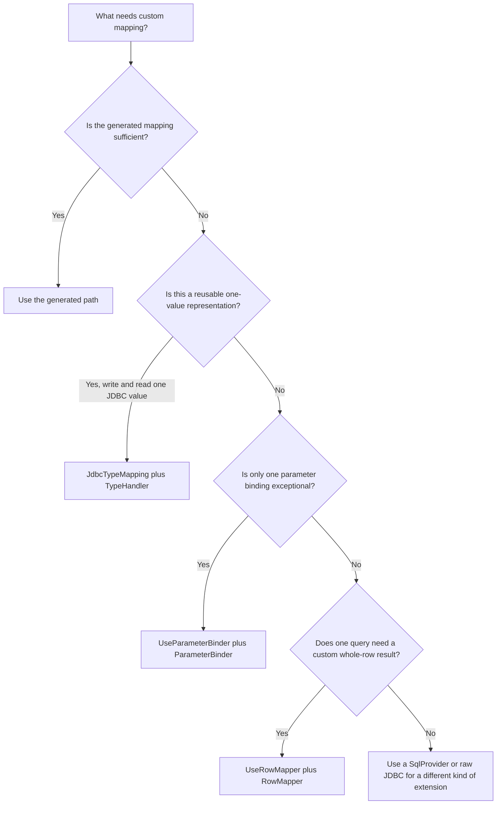
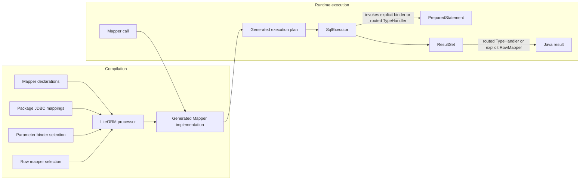

# Choosing a Value or Row Mapping

LiteORM has one generated default path and three typed mapping extension points. They operate at different scopes and solve different problems.

The shortest mental model is:

- a **type handler** defines how one reusable Java value maps to one JDBC column representation in both directions;
- **generated result mapping** composes column values into a scalar, record, or JavaBean;
- a **parameter binder** changes how one Mapper parameter is written;
- a **row mapper** changes how one query method constructs an object from a whole row.

All extension implementations are resolved during compilation. Generated Mappers hold direct references and an immutable type-handler manager. For ordinary query results, the manager uses the generated Java target type and JDBC metadata to select a handler once per result column; it does not scan, reflect, or consult a global registry.

## Start With the Generated Path

Use ordinary Mapper parameters and scalar, record, or JavaBean results whenever LiteORM already supports the shape. No extension is needed:

```java
@Select("SELECT id, name FROM users WHERE id = #{id}")
User findById(long id);
```

Generated mapping provides the strongest compile-time validation and keeps application code smallest.

Result methods do not declare a JDBC type. LiteORM combines the generated Java target type with the active driver's `ResultSetMetaData`:

- ordinary character, numeric, temporal, binary, and other supported columns need no annotation;
- BLOB, CLOB, NCLOB, SQLXML, ARRAY, and other lifecycle-bound values use the supported handler or callback contract for that value; they do not use a result-side JDBC annotation;
- `@UseRowMapper` fully owns result reading for its method, so default result type routing is not applied.

If no route exists for the generated Java type and the driver-reported JDBC type, execution fails during the mapping phase. The diagnostic identifies the target Java type, JDBC type, result column, vendor type name, and the two supported remedies: add a matching `@JdbcTypeMapping`/`TypeHandler` or use `@UseRowMapper`. LiteORM does not inspect a schema during compilation and does not provide `@ResultJdbcType`.

## Choose by Scope

| Concept | Scope | Direction | Input/output shape | Use it when |
| --- | --- | --- | --- | --- |
| Generated mapping | Mapper method | Write and read | Supported parameters, scalars, records, and JavaBeans | LiteORM already understands the Java and JDBC representation. |
| `@JdbcTypeMapping` with `TypeHandler<T>` | Mapper package | Write and read | One Java value and one JDBC column value | A Java type has a reusable database-family representation. |
| `@UseParameterBinder` with `ParameterBinder<T>` | One Mapper parameter | Write only | One annotated parameter | One parameter needs exceptional binding that should not become package policy. |
| `@UseRowMapper` with `RowMapper<T>` | One query method | Read only | One current result row, possibly several columns | One result shape cannot be generated as a scalar, record, or JavaBean. |



## JDBC Type Mapping: Reusable Value Policy

The three similarly named types form one module; they are not three competing extension choices:

| Name | Role |
| --- | --- |
| `JdbcTypeMappings` | The selected collection for a Mapper package. |
| `@JdbcTypeMapping` | One declarative entry in that collection. |
| `TypeHandler<T>` | The implementation that writes and reads the declared value representation. |

Each `@JdbcTypeMapping` entry associates:

1. one Java type;
2. one `JDBCType` representation;
3. an optional driver-reported `vendorTypeName` for JDBC types such as `OTHER`;
4. one `TypeHandler<T>` implementation.

The collection is selected once for every package that directly contains Mappers. The processor validates it and generates an immutable Mapper-local type-handler manager containing those handlers.

```java
@JdbcTypeMapping(
    javaType = Money.class,
    jdbcType = JDBCType.DECIMAL,
    vendorTypeName = "money",
    handler = MoneyTypeHandler.class
)
public final class ApplicationJdbcTypeMappings
        implements JdbcTypeMappings {
}
```

Use a complete official collection as the base and select at most one explicit application override from the same package annotation:

```java
@UseJdbcTypeMappings(
    value = PostgreSqlJdbcTypeMappings.class,
    overrides = ApplicationJdbcTypeMappings.class
)
package com.example.account.mapper;
```

Compilation loads the base first and the application collection second. The application declaration replaces the exact same Java type, `JDBCType`, and optional vendor type name key; a new key is appended. The base collection still owns inferred parameter defaults, so appending an alternative representation never changes an undeclared parameter implicitly; select the alternative with placeholder `jdbcType` metadata or `@UseParameterBinder` when vendor information is also required. Query results use JDBC metadata, including the vendor type name when declared, to choose among the generated routes. Duplicate keys inside either collection are errors. No collection is appended or discovered implicitly.

Use this path when the rule should apply consistently across Mapper methods in the same database package. Examples include PostgreSQL native UUID values, a project-wide `Money` representation, or an enum representation selected by an explicit JDBC type.

A type handler works with one value at a time. It is not appropriate for combining several columns into an aggregate object.

## Generated Result Mapping and MyBatis `resultMap`

Generated result mapping and JDBC type mapping are layers, not alternatives. Generated mapping decides which result column supplies each constructor argument or property. The runtime type-handler manager selects the `TypeHandler` that converts each column value.

```text
one result row -> generated record/JavaBean mapping
                  |-- id column      -> Long value mapping
                  |-- balance column -> Money TypeHandler
                  `-- status column  -> enum TypeHandler
```

Consequently, a declarative whole-row mapping cannot replace JDBC type mappings: it still needs a conversion for every non-built-in column value, and it has no role in Mapper parameter binding. Conversely, JDBC type mappings cannot describe how several columns are assembled into one object.

LiteORM currently generates scalar, record, and JavaBean result mapping directly. MyBatis XML `resultMap` declarations, including complex graphs, are not a supported parallel mapping engine. Flatten a simple shape to a record or JavaBean; use `@UseRowMapper` when the row requires logic that generated mapping cannot express.

## Parameter Binder: One Exceptional Write

`ParameterBinder<T>` belongs to one annotated Mapper parameter:

```java
int insert(
    @UseParameterBinder(BinaryUuidBinder.class)
    UUID id
);
```

Use it when only this parameter needs special treatment—for example, one UUID parameter stored as vendor-specific binary data while the package normally uses a string representation.

A parameter binder is write-only. It does not define how query results are read. If the same Java/JDBC representation should be reused for both writes and reads, define a `TypeHandler` instead.

## Row Mapper: One Exceptional Read Shape

`RowMapper<T>` is the method-level, read-only escape hatch for one query:

```java
@UseRowMapper(UserSummaryRowMapper.class)
@Select("SELECT u.id, u.name, count(o.id) AS order_count FROM users u ...")
UserSummary findSummary(long id);
```

Use it when one result object needs custom construction from the current row, especially when several columns participate or the target cannot follow LiteORM's record and JavaBean rules.

A row mapper is read-only and method-specific. It should not be used to establish a reusable JDBC representation for a scalar Java type.

### Does a Row Mapper Replace JDBC Type Mappings?

Only on the result side of the annotated query method.

```java
@UseRowMapper(UserRowMapper.class)
@Select("SELECT id, name FROM users WHERE status = #{status}")
List<User> findByStatus(Status status);
```

For this method:

- the package's JDBC type mappings still bind `status`;
- `UserRowMapper` replaces generated result mapping for each current row;
- JDBC type mappings continue to serve every other Mapper method in the package.

A row mapper reads the `ResultSet` directly and fully bypasses default result type routing for that method. If a query has no parameters and a row mapper handles every result column, the package mappings do no runtime work for that particular method, although the package still has one compile-time mapping selection.

## Compilation and Runtime Responsibilities



The runtime distinction is therefore mechanical:

- parameter binding ends at `PreparedStatement`;
- type handlers participate in parameter binding and single-column reading;
- row mapping starts from the current `ResultSet` row and produces the method's result element.

## Practical Decision Rules

- Prefer generated mapping first.
- Use a type handler when the representation is a reusable property of a Java type within one database package.
- Let generated scalar, record, or JavaBean mapping compose those atomic column values for ordinary query results.
- Use a parameter binder when the exception belongs to one parameter rather than the package's type policy.
- Use a row mapper only as the method-level, read-only escape hatch when the exception belongs to one result shape rather than one column value.
- A row mapper replaces only the annotated method's result mapping; it does not replace parameter binding or the package's mapping policy.
- Use raw JDBC when the application must own streaming, vendor resources, multi-row aggregation, or lifecycle behavior outside these interfaces.

The exact validation, lifecycle, null-binding, visibility, and concurrency requirements remain defined by the [Extension Contracts](../../reference/extensions.md).
